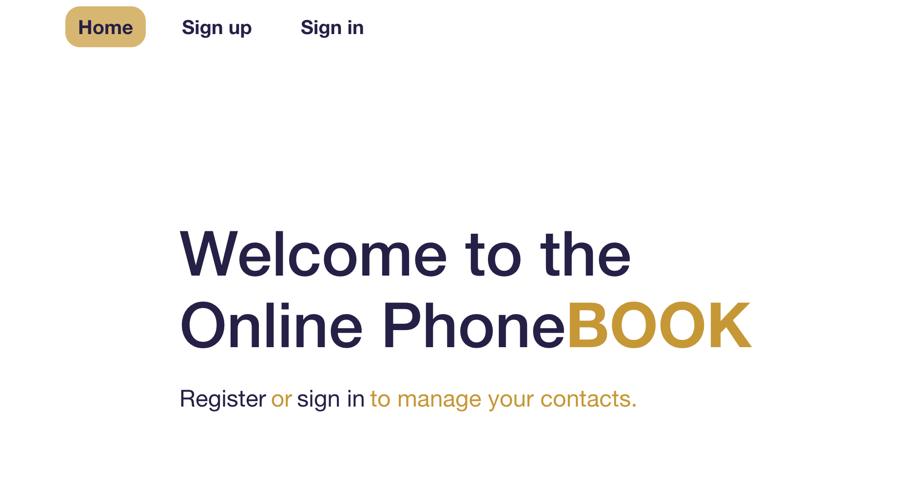

# Phonebook - Find a person

**Link to** [BACKEND-repo](https://github.com/AnnMatsarska/api-phonebook)

## About the project:

The Phonebook App offers a streamlined solution for efficient contact
management. Users can establish an account for secure data storage, facilitating
the seamless addition and organization of contacts. The application also ensures
smooth synchronization across multiple devices, eliminating the complexities of
manual transfers. With an intuitive interface, this app is designed to simplify
the process of managing your contacts effectively.

This project is written in JavaScript in combination with React JS for the
frontend and Node.js for the backend, combining these technologies for efficient
and reliable development.

## Technologies used in the project

**Front-end**  `JavaScript` `React` `ReduxToolkit` `ReduxPersist` `Axios`
`HTML/CSS` `MUI` `Styled-components`

**Back-end**  `Node.js` `Express` `Mongoose` `Joi` `Nodemailer` `MongoDB`

## Demo

You can access the live demo of the application
[here](https://annmatsarska.github.io/phonebook-find-a-person/)
